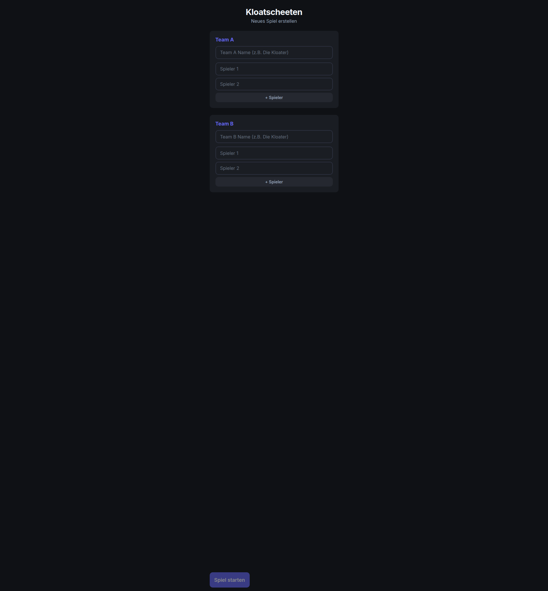
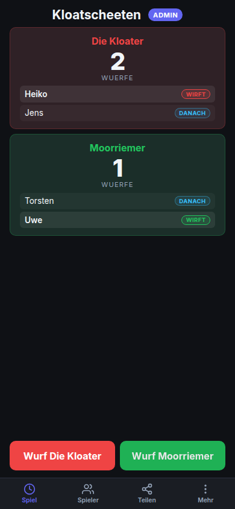

# Kloatscheeten

Mobile-optimierte Progressive Web App zum Live-Tracking von Kloatscheeten-Spielen. Ein Admin erstellt das Spiel und zaehlt Wuerfe, alle anderen verfolgen den Stand in Echtzeit per geteiltem Link.

Weniger Wuerfe = Gewinner.

**Live testen:** [kloatscheeten.altholtmann.com](https://kloatscheeten.altholtmann.com)

## Screenshots

<p align="center">
  
  
</p>

## Features

- **Live-Tracking** per WebSocket (Socket.io) - alle Zuschauer sehen Wuerfe sofort
- **Admin-Steuerung** - Wuerfe zaehlen, rueckgaengig machen, Spiel beenden
- **Spielerverwaltung** - Spieler hinzufuegen, entfernen, Reihenfolge aendern, Werfer setzen
- **PWA** - installierbar, offline-faehig, Portrait-Modus
- **Link-Sharing** - Zuschauer-Link und separater Admin-Link
- **Automatische Reconnection** mit Socket.io Connection State Recovery

## Tech Stack

| Schicht | Technologie |
|---|---|
| Runtime | Node.js 22 (native TypeScript via `--experimental-strip-types`) |
| Backend | Express 5, Socket.io 4 |
| Datenbank | SQLite (better-sqlite3, WAL-Modus) |
| Frontend | Vue 3 (Composition API), vue-router 4 |
| Build | Vite 6, vite-plugin-pwa |
| Deployment | Docker (Multi-Stage Build) |

## Schnellstart

### Docker (empfohlen)

```bash
docker compose up -d
```

Die App laeuft auf `http://localhost:12000`. Die SQLite-Datenbank wird in einem Docker-Volume persistiert.

### Lokale Entwicklung

```bash
npm ci

# Server (Port 12000)
npm run dev --workspace=server

# Frontend (Vite Dev-Server mit Proxy)
npm run dev --workspace=frontend
```

Der Vite Dev-Server leitet `/api` und `/socket.io` automatisch an `http://localhost:12000` weiter.

## Projektstruktur

```
cloatscheeten/
  frontend/          # Vue 3 SPA
    src/
      views/         # HomeView, GameView
      components/    # ScoreBoard, AdminControls, PlayerManager, ...
      composables/   # useGameRoom (Socket.io-Logik)
  server/            # Express + Socket.io
    index.ts         # Server-Einstiegspunkt + API-Routen + Socket-Events
    db.ts            # SQLite-Datenbankschicht
  shared/            # Geteilte TypeScript-Typen und Events
    types.ts
    events.ts
  Dockerfile
  docker-compose.yml
```

## Umgebungsvariablen

| Variable | Standard | Beschreibung |
|---|---|---|
| `PORT` | `12000` | Server-Port |
| `DB_PATH` | `./data/games.db` | Pfad zur SQLite-Datenbank |

## API

### REST

- `GET /api/health` - Healthcheck
- `POST /api/games` - Neues Spiel erstellen
- `GET /api/games/:id` - Spielstand abrufen

### Socket.io Events

**Client -> Server:** `game:join`, `game:throw`, `game:undo`, `game:end`, `game:addPlayer`, `game:removePlayer`, `game:reorderPlayers`, `game:setThrower`

**Server -> Client:** `game:updated` (voller GameState), `game:error` (Fehlercode + Nachricht)

## Spielprinzip

1. Admin erstellt ein Spiel mit zwei Teams (je 2-8 Spieler)
2. Admin teilt den Zuschauer-Link (z.B. per WhatsApp)
3. Admin zaehlt Wuerfe per Tap auf die Wurf-Buttons
4. Alle Zuschauer sehen den Stand live auf ihrem Handy
5. Das Team mit weniger Wuerfen gewinnt
