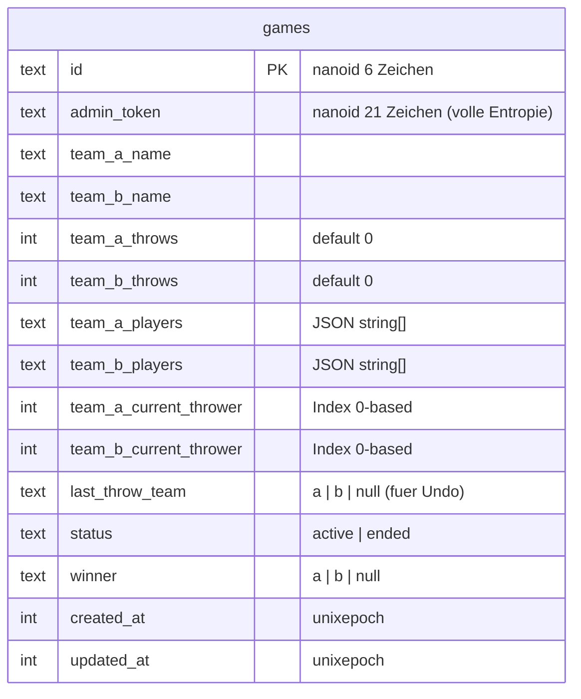

# feat: Kloatscheeten Tracker PWA

## Enhancement Summary

**Deepened on:** 2026-02-21
**Review agents used:** Security Sentinel, Performance Oracle, Architecture Strategist, TypeScript Reviewer, Frontend Races Reviewer, Code Simplicity Reviewer, Deployment Verification

### Key Improvements
1. Admin-Token aus URL entfernt -> in-memory + localStorage, aus WS-Payloads entfernt -> Socket.io Auth-Middleware
2. Shared Types Package (`shared/`) fuer typsichere Server-Client-Kommunikation
3. Optimistic UI + Pending-Guard gegen Double-Taps bei schlechtem Empfang
4. Undo-Race-Condition geloest durch Sequenznummern
5. SQLite WAL-Modus + Transaktionen fuer Undo-Atomaritaet
6. `throw_log` vereinfacht zu `last_throw_team` Spalte (YAGNI)
7. Docker healthcheck + `name: cloatscheeten` in Compose
8. Input-Validierung und Rate-Limiting spezifiziert
9. `game:error` Event hinzugefuegt fuer Server-Fehler an Clients
10. Reconnection-Handling explizit spezifiziert (`socket.recovered` Pruefung)

---

## Overview

Eine mobile-optimierte PWA zum Live-Tracking von Kloatscheeten-Spielen. Ein Admin erstellt ein Spiel, zaehlt Wuerfe ueber sein Handy, und alle Mitspieler sehen den Stand live auf ihren eigenen Handys via geteiltem Link. Selbst-gehostet als Docker-Container auf einer Synology NAS (Port 11000).

## Problem Statement / Motivation

Beim Kloatscheeten auf Feldwegen gibt es keine einfache Moeglichkeit, den Spielstand fuer alle sichtbar zu tracken. Stift und Papier ist umstaendlich bei Kaelte. Eine App die alle auf dem Handy oeffnen koennen loest das Problem.

## Proposed Solution

### Architektur

```
┌─────────────────────────────────────────────────┐
│                Docker Container                  │
│                  (Port 11000)                    │
│                                                  │
│  ┌─────────────────────────────────────────┐    │
│  │          Bun Server (index.ts)           │    │
│  │                                          │    │
│  │  ┌──────────┐  ┌───────────┐  ┌──────┐ │    │
│  │  │ Static   │  │ Socket.io │  │SQLite│ │    │
│  │  │ Files    │  │ WebSocket │  │  DB  │ │    │
│  │  │ (Vue PWA)│  │ (Realtime)│  │      │ │    │
│  │  └──────────┘  └───────────┘  └──────┘ │    │
│  └─────────────────────────────────────────┘    │
│                                                  │
│  /data/games.db  (Volume Mount)                 │
└─────────────────────────────────────────────────┘
         │
    Port 11000
         │
   ┌─────┴──────┐
   │   Clients   │
   │ (Mobile PWA)│
   └─────────────┘
```

### URL-Struktur

- `http://nas:11000/` - Startseite (Spiel erstellen)
- `http://nas:11000/game/:gameId` - Spiel-Ansicht (Viewer und Admin gleiche URL)

Der Admin-Token wird NICHT in der URL gefuehrt. Nach dem Erstellen eines Spiels wird der Token einmalig angezeigt und im Browser in `localStorage` gespeichert. Die Admin-URL wird per `history.replaceState` bereinigt.

### Admin-Authentifizierung

```
1. POST /api/games -> Response: { gameId, adminToken, viewerUrl }
2. Admin-Token wird in localStorage gespeichert: adminToken:<gameId>
3. Socket.io Verbindung sendet Token via auth-Handshake (einmalig)
4. Server validiert Token im io.use() Middleware, setzt socket.data.isAdmin
5. Alle WS-Events enthalten KEINEN Token mehr - Auth ist per Socket-Session
```

### Datenmodell



**Vereinfachung:** Kein separates `throw_log` - Undo braucht nur `last_throw_team` um den letzten Wurf rueckgaengig zu machen (Zaehler -1, Werfer-Index -1). Single-level Undo reicht fuer den Use Case.

### Input-Validierung

| Feld | Regel |
|---|---|
| Team-Name | String, 1-50 Zeichen, trimmed, required |
| Spieler-Name | String, 1-50 Zeichen, trimmed, required |
| Spieler-Anzahl | 2-8 pro Team |
| `team` Feld (WS) | Exakt `"a"` oder `"b"` |
| `gameId` | Nanoid-Format, muss in DB existieren |
| `adminToken` | Min. 21 Zeichen Nanoid |

## Tech Stack

| Komponente | Technologie | Grund |
|---|---|---|
| Frontend | Vue 3 + Vite + TypeScript | User-Praeferenz, Composition API |
| PWA | vite-plugin-pwa | Installierbar, gecachte App-Shell |
| Backend | Bun | Schnell, bun:sqlite eingebaut |
| Realtime | Socket.io | Reconnection, Rooms, Auth-Middleware |
| Datenbank | SQLite (bun:sqlite) + WAL-Modus | Kein separater DB-Server |
| Types | shared/ Package | Typsicherheit Server <-> Client |
| Deployment | Docker (oven/bun:1-alpine) | Synology NAS, Port 11000 |

## Acceptance Criteria

### Funktionale Anforderungen

- [x] Admin kann ein neues Spiel erstellen (2 Teams, je 2-8 Spieler mit Namen)
- [x] Admin erhaelt Admin-Token + teilbaren Viewer-Link nach Erstellung
- [x] Viewer koennen ueber den Link dem Spiel beitreten und den Live-Stand sehen
- [x] Admin kann Wuerfe fuer Team A oder Team B zaehlen (je ein Button)
- [x] Wurf-Button zeigt optimistisches Update + ist gesperrt bis Server bestaetigt
- [x] App zeigt aktuellen Werfer pro Team an (automatisch rotierend)
- [x] Admin kann den letzten Wurf rueckgaengig machen (Single-Level Undo)
- [x] Admin kann das Spiel beenden - Ergebnis wird allen Viewern automatisch angezeigt
- [x] Mehrere Spiele koennen gleichzeitig existieren (verschiedene Game-IDs)
- [x] Nur der Admin (via Socket.io Auth) kann Wuerfe zaehlen, Viewer sind read-only

### Technische Anforderungen

- [x] PWA installierbar (manifest.json, Service Worker fuer App-Shell Caching)
- [x] "Verbindung unterbrochen"-Banner bei WebSocket-Disconnect
- [x] WebSocket-Reconnection: bei socket.recovered=true weiter, sonst game:join re-emit
- [x] Spielstand wird sofort in SQLite persistiert (ueberlebt Container-Restart)
- [x] Docker-Container laeuft auf Port 11000 mit Healthcheck
- [x] SQLite-Datenbank auf Docker Volume (persistent)
- [x] Alle DB-Werte die aus User-Input stammen via prepared statements gebunden
- [x] Server-seitiges Rate-Limiting: max 10 Throw-Events/Sekunde pro Socket

## Implementation Phases

### Phase 1: Projekt-Setup, Shared Types & Server

Projektstruktur, Shared Types, Bun-Server mit SQLite und Socket.io aufsetzen.

**Aufgaben:**
- [x] Monorepo mit npm Workspaces: `shared/`, `server/`, `frontend/`
- [x] Shared Types definieren (`shared/types.ts`, `shared/events.ts`)
- [x] Node.js-Server mit HTTP + Socket.io (`server/index.ts`)
- [x] SQLite-Schema mit WAL-Modus und prepared statements (`server/db.ts`)
- [x] Socket.io Auth-Middleware: Token-Validierung im Handshake
- [x] API-Endpunkte: `POST /api/games`, `GET /api/games/:id`, `GET /api/health`
- [x] Socket.io Rooms + Events (siehe Event-Tabelle)
- [x] Spiellogik: Wurf zaehlen, Undo, Werfer rotieren, Spiel beenden (in `server/db.ts`)
- [x] Rate-Limiting fuer mutating Events (simple Map-basiert)

**Shared Types (`shared/types.ts`):**

```typescript
export type Team = 'a' | 'b'
export type GameStatus = 'active' | 'ended'

export interface TeamState {
  name: string
  throws: number
  players: readonly string[]
  currentThrowerIndex: number
}

export interface GameState {
  id: string
  teamA: TeamState
  teamB: TeamState
  status: GameStatus
  winner: Team | null
  createdAt: number
  updatedAt: number
}

export function getCurrentThrower(team: TeamState): string {
  return team.players[team.currentThrowerIndex % team.players.length]
}
```

**Shared Events (`shared/events.ts`):**

```typescript
import type { GameState, Team } from './types'

export type GameErrorCode =
  | 'GAME_NOT_FOUND'
  | 'INVALID_TOKEN'
  | 'GAME_ALREADY_ENDED'
  | 'CANNOT_UNDO'
  | 'RATE_LIMITED'

export interface ClientToServerEvents {
  'game:join': (
    payload: { gameId: string },
    callback: (state: GameState | null) => void
  ) => void
  'game:throw': (payload: { gameId: string; team: Team }) => void
  'game:undo': (payload: { gameId: string }) => void
  'game:end': (payload: { gameId: string }) => void
  'game:leave': (payload: { gameId: string }) => void
}

export interface ServerToClientEvents {
  'game:updated': (state: GameState) => void
  'game:error': (error: { code: GameErrorCode; message: string }) => void
}
```

**SQLite Setup (`server/db.ts`):**

```typescript
const db = new Database(process.env.DB_PATH ?? '/data/games.db', { create: true })
db.run('PRAGMA journal_mode = WAL')
db.run('PRAGMA synchronous = NORMAL')
db.run('PRAGMA busy_timeout = 5000')
db.run('PRAGMA foreign_keys = ON')

// Alle Statements bei Module-Load preparen, nicht in Handlern
const stmtGetGame = db.prepare<GameRow, [string]>('SELECT * FROM games WHERE id = ?')
const stmtUpdateThrows = db.prepare(...)
// etc.
```

**Dateien:**
```
shared/
  types.ts            # GameState, TeamState, Team, etc.
  events.ts           # Socket.io Event Maps
  package.json
server/
  index.ts            # Bun HTTP + Socket.io + Static Serving + Auth Middleware
  db.ts               # SQLite Schema + Prepared Statements + WAL
  game-logic.ts       # Spiellogik (throw, undo, end, state)
  package.json
```

### Phase 2: Frontend - Spiel erstellen

Vue 3 App mit Vite. Startseite zum Erstellen eines Spiels.

**Aufgaben:**
- [x] Vue 3 + Vite + TypeScript scaffolden
- [x] Vue Router: `/` (Home), `/game/:id` (Spiel)
- [x] Startseite (`HomeView.vue`):
  - Formular: Team A Name + Spielernamen, Team B Name + Spielernamen
  - Spieler dynamisch hinzufuegen/entfernen (min 2, max 8 pro Team)
  - Client-seitige Validierung (Name-Laenge, min/max Spieler)
  - "Spiel starten" Button -> POST /api/games -> Admin-Token in localStorage speichern -> Redirect
- [x] Nach Erstellung: Admin-Token + Viewer-Link anzeigen (kopierbarer Link fuer WhatsApp)
- [x] Minimales, mobile-optimiertes CSS (kein UI-Framework)

**Dateien:**
```
frontend/
  src/
    views/HomeView.vue       # Spiel erstellen
    views/GameView.vue       # Spiel anzeigen (Phase 3)
    router/index.ts
    App.vue
    main.ts
  vite.config.ts
  package.json
```

### Phase 3: Frontend - Spielansicht (Admin + Viewer)

Die Hauptansicht: Live-Score, Werfer-Anzeige, Wurf-Buttons (nur fuer Admin).

**Aufgaben:**
- [x] Socket.io Client-Singleton mit typed Events (`src/socket.ts`)
- [x] Socket.io Auth: Token aus localStorage lesen, via `auth` Option senden
- [x] `useGameRoom` Composable mit explizitem Return-Type:
  - Socket verbinden, game:join mit Acknowledgement-Callback
  - Reconnection: `socket.recovered` pruefen, sonst game:join re-emitieren
  - Optimistic UI: lokaler Zaehler + pendingThrow Guard
  - game:leave in onUnmounted emitieren
  - Named Handler-Referenzen fuer socket.off Cleanup
- [x] `GameView.vue` - Layout (mobile-first):
  ```
  ┌──────────────────────────────┐
  │  ⚠ Verbindung unterbrochen   │  <- ConnectionBanner (nur bei Disconnect)
  ├──────────────────────────────┤
  │                              │
  │   Team A: "Die Kloater"     │
  │        Wuerfe: 12           │
  │   Naechster: Hans           │
  │                              │
  │   ────────────────────────   │
  │                              │
  │   Team B: "Die Scheeter"    │
  │        Wuerfe: 11           │
  │   Naechster: Peter          │
  │                              │
  ├──────────────────────────────┤
  │  [Wurf Team A] [Wurf Team B] │  <- Nur fuer Admin sichtbar
  │        [Rueckgaengig]        │  <- Deaktiviert wenn pendingThrow oder 0 Wuerfe
  │       [Spiel beenden]        │  <- Mit Bestaetigungsdialog
  └──────────────────────────────┘
  ```
- [x] Admin-Erkennung: Token aus localStorage laden, Admin-UI nur bei socket.data.isAdmin
- [x] Undo-Button: Deaktiviert wenn 0 Wuerfe oder pendingThrow
- [x] Ergebnis-Screen nach Spielende (allen Clients via game:updated gepusht)
- [x] ConnectionBanner: "Verbindung unterbrochen - wird automatisch wiederhergestellt"
- [x] Viewer: Gleiche Ansicht ohne Admin-Buttons
- [x] Fehler-Handling: game:error Events anzeigen (Toast oder inline)

**Optimistic UI Pattern:**

```typescript
const pendingThrow = ref(false)
const optimisticDelta = ref({ a: 0, b: 0 })

function throwForTeam(team: Team) {
  if (pendingThrow.value) return  // Guard gegen Double-Tap
  pendingThrow.value = true
  optimisticDelta.value[team]++
  socket.emit('game:throw', { gameId, team })
}

// Bei game:updated: optimisticDelta zuruecksetzen, pendingThrow = false
// Bei game:error: optimisticDelta rollback, pendingThrow = false
```

**Socket.io Client Config:**

```typescript
const socket: ClientSocket = io({
  autoConnect: false,
  auth: { token: adminToken },
  reconnection: true,
  reconnectionDelay: 1000,
  reconnectionDelayMax: 2000,  // Schnell reconnecten - User wartet in der Kaelte
  reconnectionAttempts: Infinity,
})
```

**Dateien:**
```
frontend/src/
  socket.ts                        # Socket.io Singleton mit typed Events + Auth
  composables/useGameRoom.ts       # Reactive Game State + Optimistic UI
  views/GameView.vue               # Haupt-Spielansicht
  components/ScoreBoard.vue        # Team-Anzeige mit Wuerfen + Werfer
  components/AdminControls.vue     # Wurf-Buttons, Undo, Beenden
  components/ConnectionBanner.vue  # Offline/Reconnecting Anzeige
  components/GameResult.vue        # Ergebnis nach Spielende
```

### Phase 4: PWA + Offline

Service Worker und PWA-Manifest konfigurieren.

**Aufgaben:**
- [x] `vite-plugin-pwa` konfigurieren:
  - `registerType: 'autoUpdate'`
  - App-Shell precaching
  - API + Socket.io URLs: `NetworkOnly` (keine stale Caches)
- [x] PWA Manifest: `display: standalone`, `orientation: portrait`
- [x] PWA Icons erstellen (192x192, 512x512)
- [ ] Testen: App zum Homescreen hinzufuegen, offline oeffnen (Shell laedt), reconnecten

**Workbox Config:**

```typescript
workbox: {
  globPatterns: ['**/*.{js,css,html,ico,png,svg,woff2}'],
  runtimeCaching: [{
    urlPattern: /^\/api\//,
    handler: 'NetworkFirst',
    options: {
      cacheName: 'api-cache',
      networkTimeoutSeconds: 3,
      expiration: { maxEntries: 20, maxAgeSeconds: 60 },
    },
  }],
}
```

### Phase 5: Docker + Deployment

Container bauen und auf Synology deployen.

**Vor-Deployment Checks:**
- [ ] `uname -m` auf Synology pruefen (x86_64 oder aarch64 noetig, NICHT armv7l)
- [ ] Port 11000 frei: `ss -tlnp | grep 11000`
- [ ] Synology Firewall erlaubt TCP 11000 vom LAN
- [ ] Port 11000 ist NICHT per Router ins WAN weitergeleitet

**Aufgaben:**
- [x] Multi-stage Dockerfile (node:22-alpine)
- [x] `docker-compose.yml` mit Volume und Healthcheck
- [x] `.dockerignore` (node_modules, .git, dist, docs)
- [ ] rsync zum NAS, docker compose build, docker compose up -d
- [ ] Testen: Container bauen, starten, Spiel erstellen, auf Handy oeffnen

```dockerfile
# Stage 1: Build Vue frontend
FROM oven/bun:1-alpine AS build
WORKDIR /build
COPY shared/ ./shared/
COPY frontend/package.json frontend/bun.lockb ./frontend/
RUN cd frontend && bun install --frozen-lockfile
COPY frontend/ ./frontend/
RUN cd frontend && bun run build

# Stage 2: Production
FROM oven/bun:1-alpine
WORKDIR /app
COPY shared/ ./shared/
COPY server/package.json server/bun.lockb ./
RUN bun install --frozen-lockfile --production
COPY server/ .
COPY --from=build /build/frontend/dist ./frontend/dist
RUN mkdir -p /data
ENV PORT=11000
EXPOSE 11000
VOLUME ["/data"]
CMD ["bun", "run", "index.ts"]
```

```yaml
# docker-compose.yml
name: cloatscheeten

services:
  cloatscheeten:
    build: .
    ports:
      - "11000:11000"
    volumes:
      - game_data:/data
    environment:
      - PORT=11000
      - DB_PATH=/data/games.db
    restart: unless-stopped
    healthcheck:
      test: ["CMD", "wget", "-qO-", "http://localhost:11000/api/health"]
      interval: 30s
      timeout: 5s
      retries: 3

volumes:
  game_data:
```

**Deployment-Schritte:**

```bash
# 1. Auf den NAS transferieren
rsync -av --exclude='node_modules' --exclude='.git' --exclude='frontend/dist' \
  . admin@<nas-ip>:/volume1/docker/cloatscheeten/

# 2. Auf dem NAS bauen und starten
ssh admin@<nas-ip>
cd /volume1/docker/cloatscheeten
docker compose build --no-cache
docker compose up -d
docker compose logs --tail=30  # Auf Fehler pruefen

# 3. Verifizieren
curl -s http://localhost:11000/api/health
docker compose ps  # Status "Up", kein Restart-Loop
```

**Rollback:** `docker compose down` (OHNE -v!), Code zuruecksetzen, neu bauen.

## Socket.io Events (Komplett)

| Event | Richtung | Payload | Beschreibung |
|---|---|---|---|
| `game:join` | Client -> Server | `{ gameId }` + Ack-Callback | Room beitreten, State via Callback erhalten |
| `game:throw` | Client -> Server | `{ gameId, team: "a"\|"b" }` | Wurf zaehlen (Token via Socket Auth) |
| `game:undo` | Client -> Server | `{ gameId }` | Letzten Wurf rueckgaengig (Token via Socket Auth) |
| `game:end` | Client -> Server | `{ gameId }` | Spiel beenden (Token via Socket Auth) |
| `game:leave` | Client -> Server | `{ gameId }` | Room verlassen (bei Navigation/Unmount) |
| `game:updated` | Server -> Room | `GameState` | Broadcast: State hat sich geaendert |
| `game:error` | Server -> Client | `{ code, message }` | Fehler: GAME_NOT_FOUND, INVALID_TOKEN, CANNOT_UNDO, etc. |

**Kein separates `game:state` Event.** `game:join` nutzt Socket.io Acknowledgement-Callbacks - der State kommt als direkter Rueckgabewert.

## Edge Cases

| Szenario | Verhalten |
|---|---|
| Admin schliesst Browser | Admin oeffnet URL erneut, Token aus localStorage -> Admin-Modus |
| Admin-Token verloren | Neues Spiel erstellen noetig |
| Viewer oeffnet Link nach Spielende | Sieht Ergebnis-Screen |
| Viewer oeffnet Link vor Spielstart | Sieht "Spiel wird vorbereitet" |
| WebSocket disconnect | Banner "Verbindung unterbrochen", Auto-Reconnect (max 2s Delay) |
| Reconnect < 2 min | socket.recovered=true: kein Datenverlust |
| Reconnect > 2 min | socket.recovered=false: game:join re-emit fuer vollen State |
| Container-Restart | SQLite auf Volume, Spielstand bleibt erhalten |
| Undo bei 0 Wuerfen | Button deaktiviert, Server sendet game:error CANNOT_UNDO |
| Double-Tap auf Wurf-Button | pendingThrow Guard verhindert zweiten Emit |
| Versehentlich falsches Team | Undo + korrektes Team tippen |
| Ungueltige Game-ID in URL | game:join Callback liefert null -> "Spiel nicht gefunden" |
| Ungueltiger Admin-Token | Socket Auth-Middleware setzt isAdmin=false -> Viewer-Modus |
| Zwei Admin-Tabs offen | Server-seitiger Debounce (300ms) verhindert Doppel-Wuerfe |
| PWA vom Homescreen geoeffnet | Token aus localStorage geladen (URL hat keinen Token) |
| SW-Update waehrend Spiel | autoUpdate: Update wird erst bei naechstem App-Start aktiv |

## Projektstruktur (Komplett)

```
cloatscheeten/
  shared/
    types.ts              # GameState, TeamState, Team, GameStatus
    events.ts             # ClientToServerEvents, ServerToClientEvents, GameErrorCode
    package.json
  server/
    index.ts              # Bun HTTP + Socket.io + Static Serving + Auth Middleware
    db.ts                 # SQLite Schema + WAL + Prepared Statements
    game-logic.ts         # Spiellogik (throw, undo, end, state, validation)
    package.json
  frontend/
    public/
      icons/              # PWA Icons (192x192, 512x512)
    src/
      socket.ts           # Socket.io Singleton mit typed Events + Auth
      composables/
        useGameRoom.ts    # Reactive Game State + Optimistic UI + Reconnection
      views/
        HomeView.vue      # Spiel erstellen
        GameView.vue      # Spiel anzeigen (Admin + Viewer)
      components/
        ScoreBoard.vue    # Team-Scores + aktueller Werfer
        AdminControls.vue # Wurf-Buttons + Undo + Spiel beenden
        ConnectionBanner.vue  # Offline/Reconnecting Anzeige
        GameResult.vue    # Ergebnis nach Spielende
      router/
        index.ts
      App.vue
      main.ts
    vite.config.ts
    package.json
  Dockerfile
  docker-compose.yml
  .dockerignore
  package.json            # Root: Bun Workspaces config
```

## References & Research

### Technologie-Dokumentation
- [vite-plugin-pwa Guide](https://vite-pwa-org.netlify.app/guide/)
- [Socket.IO v4 Rooms](https://socket.io/docs/v3/rooms/)
- [Socket.IO Connection State Recovery](https://socket.io/docs/v4/connection-state-recovery)
- [Socket.IO Auth Middleware](https://socket.io/docs/v4/middlewares/)
- [Bun SQLite](https://bun.com/docs/runtime/sqlite)
- [Bun Workspaces](https://bun.sh/docs/install/workspaces)
- [Socket.IO + Bun Engine](https://socket.io/blog/bun-engine/)
- [Vue 3 Composition API](https://vuejs.org/guide/quick-start)

### Kloatscheeten-Regeln
- [Dein Niedersachsen - Klootschiessen](https://www.dein-niedersachsen.de/regionen/klootschiessen/)
- [Planet Schule - Regeln](https://www.planet-schule.de/spielederwelt/spiele/klootbosseln/regeln.html)
- [Campingplatz Gronau - Kloatscheeten](https://www.campingplatz-gronau.com/kloatscheeten/)

### Brainstorm
- [Brainstorm-Dokument](../brainstorms/2026-02-21-kloatscheeten-tracker-brainstorm.md)
